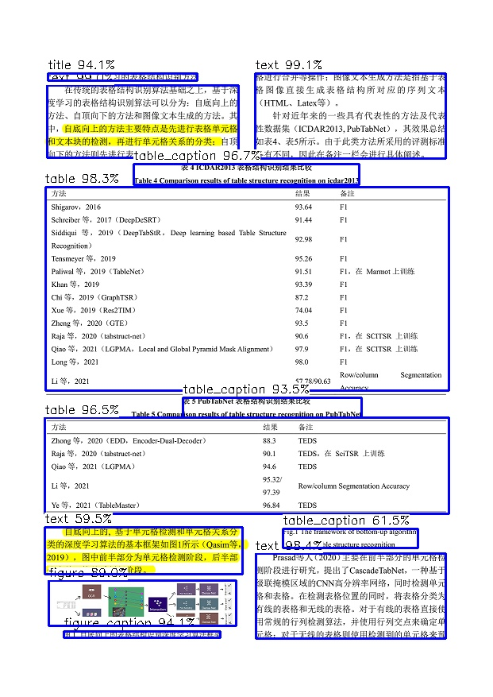
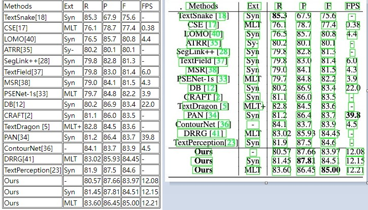

# ncnn_ppstructure
ppstructure deploy by ncnn

## Result:  
  
  

## model support:  
```shell
├── det.bin         
├── det.param                    #文字检测模型(ppocrv4 lite)
├── det_server.bin
├── det_server.param             #文字检测模型(ppocrv4 server)
├── db_nas.bin
├── db_nas.param                 #魔搭轻量化文字检测模型(https://www.modelscope.cn/models/iic/cv_proxylessnas_ocr-detection-db-line-level_damo)
├── layout_cdla.bin              #中文layout模型(PP-StructureV2)
├── layout_cdla.param
├── layout_publaynet.bin         #英文layout模型(PP-StructureV2)
├── layout_publaynet.param 
├── layout_table.bin             #表格layout模型(PP-StructureV2)
├── layout_table.param
├── v8_layout_general6.bin       #表格layout模型(yolov8 general6)
├── v8_layout_general6.param
├── v8_layout_publaynet.bin      #表格layout模型(yolov8 publaynet)
├── v8_layout_publaynet.param
├── v8_layout_paper.bin          #表格layout模型(yolov8 paper)
├── v8_layout_paper.param
├── v8_layout_report.bin         #表格layout模型(yolov8 report)
├── v8_layout_report.param
├── rec.bin
├── rec.param               #文字识别模型(ppocrv4 lite)
├── rec_server.bin
├── rec_server.param        #文字识别模型(ppocrv4 server)
├── liteocr.bin
├── liteocr.param           #魔搭轻量化文字识别模型(https://modelscope.cn/models/iic/cv_LightweightEdge_ocr-recognitoin-general_damo/summary)
├── convnextvit.bin
├── convnextvit.param       #魔搭文字识别模型(https://www.modelscope.cn/models/iic/cv_convnextTiny_ocr-recognition-general_damo)
├── slanet_ch.bin
├── slanet_ch.param           #中文表格检测模型(PP-StructureV2)
├── slanet_en.bin
└── slanet_en.param           #英文表格检测模型(PP-StructureV2)
```

## Reference：  
https://github.com/Tencent/ncnn  
https://github.com/PaddlePaddle/PaddleOCR  
https://www.modelscope.cn/models?page=1&tasks=ocr&type=cv  
https://github.com/360AILAB-NLP/360LayoutAnalysis  